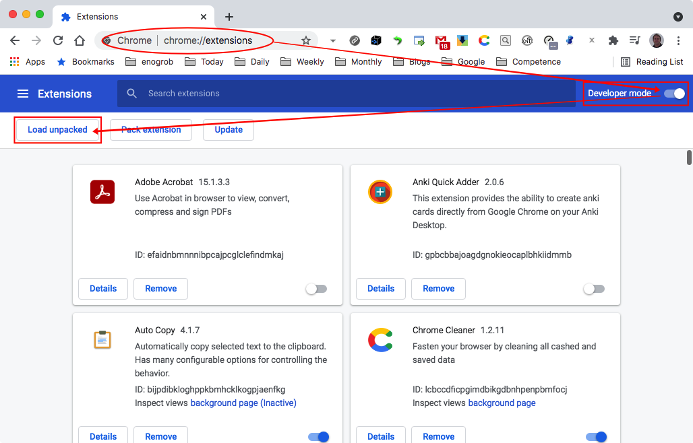
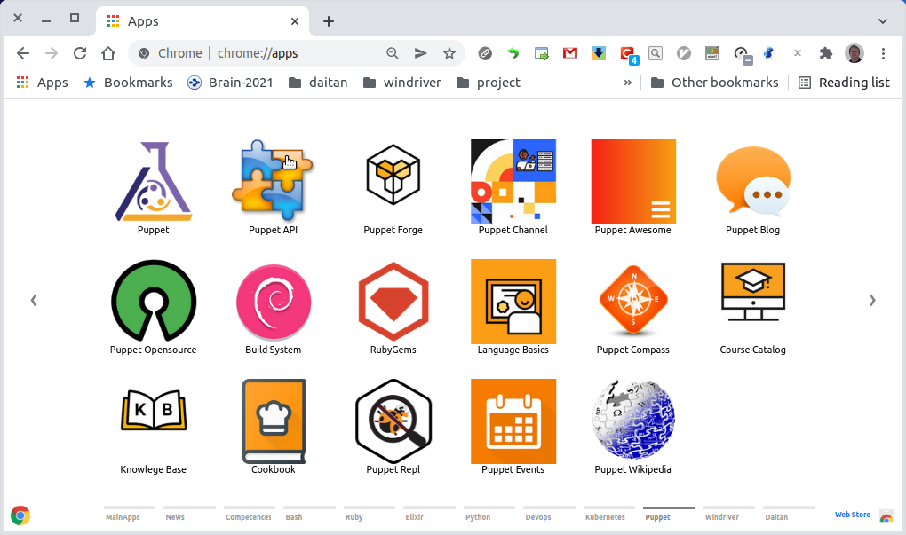

# Chrome Apps for Puppet

Gather Puppet important references and shortcuts in form of Chrome Apps.


## Installation

### 1. Clone this repository and see its contents.
Open a terminal give the following command:

```bash
$ git clone https://github.com/enogrob/chromeapps-puppet.git
```

As we can see a subdirectory is created for each Puppet app.

```bash
$ ls -la
total 400
drwxr-xr-x@   9 enogrob  staff    306 Sep 24 06:29 .
drwxr-xr-x@ 417 enogrob  staff  14178 Sep 24 05:59 ..
-rw-r--r--    1 enogrob  staff     13 Sep 17 09:58 .gitignore
-rw-r--r--@   1 enogrob  staff      0 Sep 17 09:58 Icon?
-rw-r--r--@   1 enogrob  staff   1456 Sep 24 06:36 README.md
drwxr-xr-x   20 enogrob  staff    680 Sep 24 06:17 apps
drwxr-xr-x    6 enogrob  staff    204 Sep 24 06:32 articles
drwxr-xr-x    4 enogrob  staff    136 Sep 17 09:58 images
drwxr-xr-x   17 enogrob  staff    578 Sep 24 06:33 resources

$ tree -L 1 apps/
apps
├── Puppet-API
├── Puppet-Awesome
├── Puppet-Blog
├── Puppet-BuildSystem
├── Puppet-Compass
├── Puppet-CoursesCatalog
├── Puppet-Events
├── Puppet-Forge
├── Puppet-Homepage
├── Puppet-KnowledgeBase
├── Puppet-LanguageBasics
├── Puppet-OpenSource
├── Puppet-RubyGems
├── Puppet-RubyRepl
├── Puppet-Wikipedia
└── Puppet-YouTube

16 directories, 0 files
```

### 2. Open Chrome with the following url:
In order to load the `Chrome Apps` for Puppet, check `Developer Mode` and press `Load unpacked extension...` to load each App selecting its corresponding directory inside `apps` e.g. `Puppet-Homepage`, and then repeat that for the wanted apps. 



Or just drag and drop the app folder on the [Extensions page](chrome://extensions).


### 3. After load the Chrome Apps wanted for Puppet, Chrome will look like the screenshot below:



Pressione the Chrome "Apps" button and then look for the ones you have inserted. You can drag as you want in order to put them in desired order.
